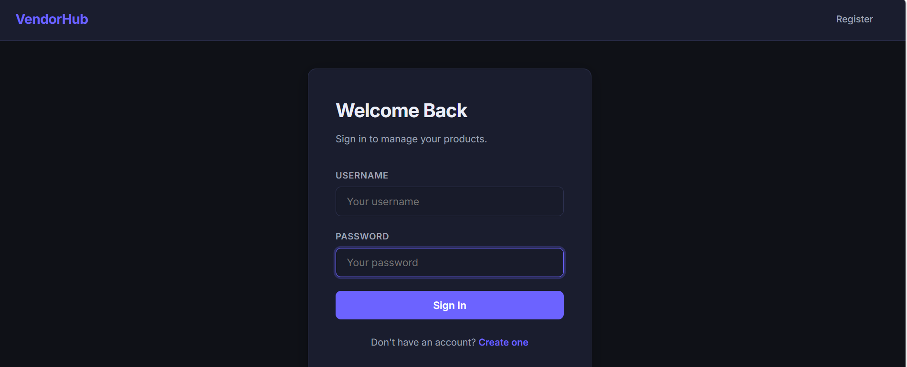
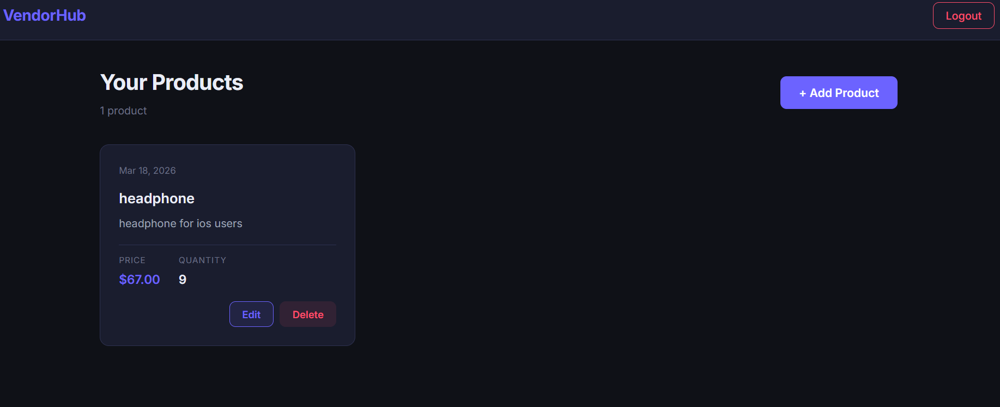

# Vendor Product Management — VendorHub

A full-stack web application for managing vendor products, built with **Django REST Framework** (backend) and **Next.js** (frontend).

---

## Project Structure

```
natechsys/
├── backend/                 # Django + DRF API server
│   ├── vendor_management/   # Django project settings & URLs
│   ├── products/            # Products app (models, views, serializers)
│   ├── manage.py
│   └── requirements.txt
├── frontend/                # Next.js React app
│   └── src/app/             # Pages: login, register, dashboard
├── .gitignore
└── README.md
```

---

## Setup & Run

### Prerequisites

- Python 3.10+
- Node.js 18+
- npm

---

### Backend

**1. Create and activate a virtual environment:**

**Windows (PowerShell):**
```powershell
cd backend
python -m venv .venv
.venv\Scripts\Activate.ps1
```

**Windows (CMD):**
```cmd
cd backend
python -m venv .venv
.venv\Scripts\activate.bat
```

**Linux / macOS:**
```bash
cd backend
python3 -m venv .venv
source .venv/bin/activate
```

**2. Install dependencies:**
```bash
pip install -r requirements.txt
```

**3. Run migrations:**
```bash
python manage.py makemigrations products
python manage.py migrate
```

**4. Start the server:**
```bash
python manage.py runserver
```

The backend API will be available at **http://localhost:8000**.

---

### Frontend

```bash
cd frontend

# Install dependencies
npm install

# Start dev server (port 3000)
npm run dev
```

Open **http://localhost:3000** in your browser.

---

## How to Use

1. **Register** — Go to `/register` and create a vendor account (username + password)
2. **Login** — Go to `/login` and sign in with your credentials



3. **Dashboard** — After login, you'll see your product dashboard
4. **Manage Products** — Add, edit, and delete products from the dashboard



> Each vendor can only view and manage their own products.

---

## API Endpoints

| Method | Endpoint               | Auth     | Description                         |
|--------|------------------------|----------|-------------------------------------|
| POST   | `/api/register/`       | No       | Register a new vendor               |
| POST   | `/api/login/`          | No       | Login, returns JWT access & refresh |
| POST   | `/api/token/refresh/`  | No       | Refresh an expired access token     |
| GET    | `/api/products/`       | JWT      | List logged-in vendor's products    |
| POST   | `/api/products/`       | JWT      | Create a new product                |
| PUT    | `/api/products/{id}/`  | JWT      | Update a product                    |
| DELETE | `/api/products/{id}/`  | JWT      | Delete a product                    |

> Authentication uses Bearer JWT tokens in the `Authorization` header.

### Example: Login Request

```bash
curl -X POST http://localhost:8000/api/login/ \
  -H "Content-Type: application/json" \
  -d '{"username": "vendor1", "password": "securepass123"}'
```

Response:
```json
{
  "access": "eyJ...",
  "refresh": "eyJ..."
}
```

---

## Tech Stack

| Layer    | Technology                            |
|----------|---------------------------------------|
| Backend  | Python, Django, Django REST Framework |
| Auth     | SimpleJWT (JSON Web Tokens)           |
| Database | SQLite                                |
| Frontend | Next.js (React)                       |
